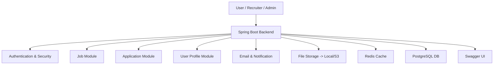

<!--
  Add your project logo below (replace the link with your image or a local file in the repo)
  
-->
<p align="center">
  
</p>

<h1 align="center">JobConnect</h1>

<p align="center">
  <b>Modern Job Portal Backend (JOB HUNT) built with Spring Boot</b><br/>
  <i>Connecting jobseekers and recruiters through efficient job postings, applications, and smart recommendations.</i>
</p>

<p align="center">
  
  
  
  
  
</p>

---

## 🚀 Features

- 🔐 **User authentication** with JWT and OTP (Jobseeker, Recruiter, Admin roles)
- 📝 **Job posting, updating, and deletion** (Recruiter)
- 🔎 **Job search and filtering** (public and authenticated)
- 📄 **Job application management** (Jobseeker & Recruiter)
- 📤 **Resume upload and management** (Jobseeker)
- 📧 **Email notifications** (welcome, OTP, application status)
- ☁️ **File storage** (local and AWS S3 support)
- ⚡ **Redis caching** for performance
- 📚 **API documentation** with Swagger/OpenAPI

## 🛠️ Tech Stack

-  Java 21
-  Spring Boot 3.5 (WebFlux, Data JPA, Security, Validation)
-  PostgreSQL (default, can be swapped)
-  Redis (caching)
- ☁️ AWS S3 (file storage, optional)
- 🦾 Lombok
- 🔑 JWT (Auth0)
- 📖 SpringDoc OpenAPI (Swagger UI)
- 🐳 Docker/Kubernetes ready structure

---

## 🏗️ Architecture Overview



---

## 🏁 Getting Started

### Prerequisites
- ☕ Java 21+
- 🛠️ Maven 3.8+
- 🐘 PostgreSQL (or compatible DB)
- 🟥 Redis

### 🚦 Clone the repository
```bash
git clone <your-repo-url>
cd JobConnect
```

### ⚙️ Configure Environment Variables
Create a `.env` file or set the following environment variables as per your environment:

#### Database
- `DB_URL` / `DATABASE_URL` (e.g. `jdbc:postgresql://localhost:5432/jobconnect`)
- `DB_USERNAME` / `DATABASE_USER_NAME`
- `DB_PASSWORD` / `DATABASE_PASSWORD`
- `HIBERNATE_DDL_AUTO` (e.g. `update`)

#### Mail
- `MAIL_HOST` (e.g. `smtp.gmail.com`)
- `MAIL_PORT` (e.g. `587`)
- `MAIL_USERNAME`
- `MAIL_PASSWORD`

#### Redis
- `REDIS_HOST` (default: `localhost`)
- `REDIS_PORT` (default: `6379`)
- `REDIS_USERNAME` (optional)
- `REDIS_PASSWORD` (optional)

#### AWS S3 (optional, for production)
- `AWS_ACCESS_KEY_ID`
- `AWS_SECRET_ACCESS_KEY`
- `AWS_REGION`
- `AWS_S3_BUCKET`

#### Other
- `SERVER_PORT` (default: `8080`)

### ▶️ Run the Application

#### Development
```bash
./mvnw spring-boot:run -Dspring-boot.run.profiles=dev
```

#### Production
```bash
./mvnw spring-boot:run -Dspring-boot.run.profiles=prod
```

---

## 📚 API Documentation

Interactive API docs are available via Swagger UI:

- [http://localhost:8080/swagger-ui.html](http://localhost:8080/swagger-ui.html)
- OpenAPI JSON: [http://localhost:8080/v3/api-docs](http://localhost:8080/v3/api-docs)

---

## 🔗 Example API Endpoints

### 👤 Authentication
- `POST /api/public/auth/signup` — Register a new user
- `POST /api/public/auth/login` — User login
- `POST /api/public/auth/verify-otp` — Verify OTP

### 💼 Jobs
- `GET /api/public/job/get-allJobs` — List all jobs (public)
- `POST /api/v1/job/create-job` — Create job (Recruiter)
- `PUT /api/v1/job/update-job` — Update job (Recruiter)
- `DELETE /api/v1/job/delete-job/{jobId}` — Delete job (Recruiter)

### 📨 Job Applications
- `POST /api/v1/jobApplication-jobseeker/apply-job` — Apply for a job (Jobseeker)
- `GET /api/v1/jobApplication-jobseeker/get-application/{applicationId}` — Get application by ID
- `DELETE /api/v1/jobApplication-jobseeker/delete-application/{applicationId}` — Delete application
- `GET /api/v1/jobApplication-jobseeker/get-applications` — List all applications by jobseeker
- `GET /api/v1/jobApplication-recruiter/get-applications?jobId={jobId}` — List all applications for a job (Recruiter)
- `PUT /api/v1/jobApplication-recruiter/update-status` — Update application status (Recruiter)

### 🧑‍💼 User Profiles
- `GET /api/v1/jobseeker/api/v1/jobseeker` — Get jobseeker profile
- `PUT /api/v1/jobseeker/update` — Update jobseeker profile
- `POST /api/v1/jobseeker/upload-resume` — Upload resume
- `DELETE /api/v1/jobseeker/delete-resume` — Delete resume
- `GET /api/v1/recruiter/` — Get recruiter profile
- `PUT /api/v1/recruiter/update` — Update recruiter profile

### 🛡️ Admin
- `GET /api/v1/users` — List all users (Admin)

---

## 🧪 Testing

Run tests with:
```bash
./mvnw test
```

> ⚠️ Note: Some tests (e.g., Redis) may require additional setup or may be disabled by default.

---

## 🚢 Deployment

- The project is structured for easy Docker/Kubernetes integration (see `src/main/resources/docker/`).
- Configure environment variables for production in your deployment environment.
- For S3 file storage, ensure AWS credentials and bucket are set.

---

## 🤝 Contributing

Contributions are welcome! Please open issues or submit pull requests for improvements or bug fixes.

---

## 📝 License

This project is currently unlicensed. Add a LICENSE file if you wish to specify usage terms.

---

<p align="center">
  <i>Made with ❤️ using Spring Boot</i>
</p>
